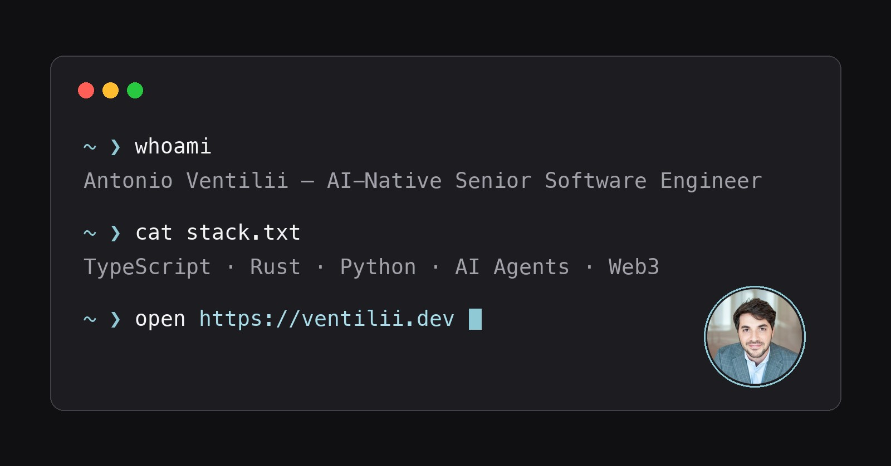
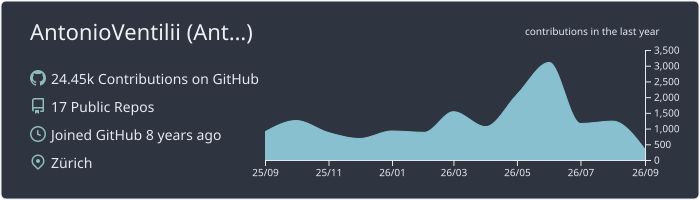
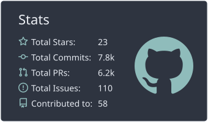
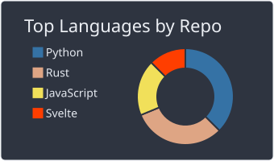
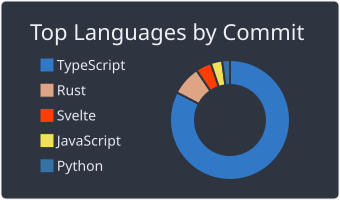
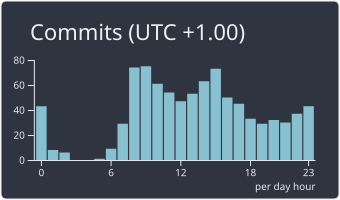

# Hi, I'm AV

<table>
  <tr>
    <td>
      
    </td>
    <td>
      
    </td>
  </tr>
  <tr>
    <td>
      
    </td>
    <td>
      
    </td>
  </tr>
</table>

<!--
  Cards are pre-rendered into assets/ by .github/workflows/refresh-cards.yml (daily).
  Generating them on page load meant GitHub's camo proxy timed out (~4s) against the
  slow upstream generators, so most cards rendered as broken images.
-->
